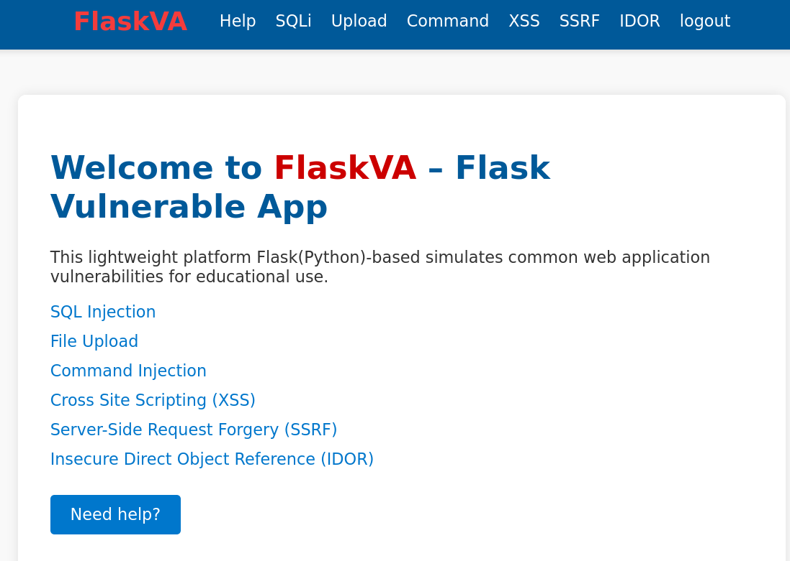

# FlaskVA

Please note this is the first version of FlaskVA. I will continue updating it when time allows.

## Authorized lab use only

FlaskVA is an intentionally vulnerable training application. Use it only in the Hullu VM or in an isolated lab environment that you own or have explicit permission to test. Do not expose the VM or this app to the internet.

## Screenshot



## FlaskVA in the Hullu VM

FlaskVA is included in the Hullu vulnerable Alpine Linux OVA. You can download it from [SourceForge](https://sourceforge.net/projects/hullu/files).

Hullu documentation, VM details, and lab credentials: https://github.com/kaledaljebur/Hullu

For Hullu setup, lab topology, VM import steps, networking, prerequisites, and credentials, use the Hullu repository. This README focuses on FlaskVA usage and the web-application scenarios inside the Hullu lab.

## Included Modules

FlaskVA includes vulnerable modules for:

- SQL injection
- File upload
- Command injection
- Cross-site scripting (XSS)
- Server-side request forgery (SSRF)
- Insecure direct object reference (IDOR)

These modules are used to generate lab activity that can later be reviewed from a defensive and blue-team perspective.

## How to run FlaskVA manually

```sh
git clone https://github.com/kaledaljebur/FlaskVA
cd FlaskVA
python3 -m venv env
```

On Windows:

```sh
.\env\Scripts\Activate.ps1
```

On Linux:

```sh
source env/bin/activate
```

Then:

```sh
pip install -r requirements.txt
python app.py
```

Open FlaskVA at `http://127.0.0.1:5000/` when running it locally. If you are using the Hullu OVA, use the VM details and credentials from the Hullu repository.

## Learning Objectives

FlaskVA is designed to support both offensive understanding and defensive analysis. The attack steps in this README are included so learners can generate realistic activity inside their own Hullu lab, then investigate that activity from a blue-team point of view.

- Understand how common web vulnerabilities appear in a small Flask application.
- Generate command injection, insecure upload, SUID abuse, local privilege escalation, and persistence events in a controlled VM.
- Practice mapping web activity to Linux process execution, file changes, privilege changes, and network connections.
- Prepare evidence for defensive workflows using tools such as Suricata and Wazuh.
- Learn what indicators should be monitored, alerted on, and cleaned up after a lab exercise.

## Known Lab Assumptions

- IP addresses such as `192.168.8.10` are examples. Replace them with your Kali attacker VM IP.
- `<Hullu-IP>` means the IP address assigned to your Hullu VM.
- The scenarios assume an isolated lab network and should not be run against systems outside your own lab.
- Some scenarios depend on Hullu-specific misconfigurations, such as SUID `wget`, and may not work on a normal Linux system.
- Commands shown in the FlaskVA command injection page are typed into the vulnerable web form, not directly into a local shell, unless the step says "On Kali" or "SSH to Hullu".

## Version Notes

- The scenarios below were tested in Kali against Hullu3.
- Hullu and FlaskVA may change over time, so confirm VM-specific details, credentials, and networking notes in the Hullu repository.
- If a scenario does not behave as expected, verify the Hullu version and whether the required lab misconfiguration is present before changing the steps.

## Cleanup After Lab Practice

After completing a scenario, collect the logs, alerts, network captures, screenshots, and other evidence needed for analysis before removing lab artifacts.

Then SSH to the Hullu VM as `root` using the credentials documented in the Hullu repository and remove the artifacts you created. This keeps the VM ready for blue-team review, re-practice, or snapshot cleanup.

Example cleanup checks:

```sh
rm -f /etc/sudoers.d/flaskva
sed -i '/flaskva ALL=(ALL) NOPASSWD: ALL/d' /etc/sudoers
sed -i '/%wheel ALL=(ALL) ALL/d' /etc/sudoers
deluser james 2>/dev/null
rm -rf /home/james
rm -f /home/flaskva/FlaskVA/static/uploads/shell.png
rm -f /home/flaskva/FlaskVA/static/uploads/shell.elf
```

If you are using VM snapshots, the cleanest reset is to revert to a known-good Hullu snapshot after collecting the logs and evidence needed for analysis.

## Practice Guides

- Red Team: [red-team.md](red-team.md) contains attack scenarios used to generate lab activity in Hullu.
- Blue Team: defensive monitoring and investigation with Suricata and Wazuh is covered in [SuriZuh](https://github.com/kaledaljebur/SuriZuh).
